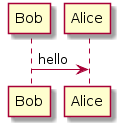

# jekyll-remote-plantuml

[](https://hakiri.io/github/Patouche/jekyll-remote-plantuml/master) [](https://travis-ci.org/Patouche/jekyll-remote-plantuml)


A plugin for jekyll to use plantuml diagram inside your [Jekyll](http://jekyllrb.com/) for you website. This will use external resource to build plantuml diagram. Once created, the diagram is store on the filesystem to prevent any unnecessary diagram generation. So, using this plugin, provide a simple way to integrate plantuml diagramm without the [Graphiz](http://www.graphviz.org/) software or the using the [plantuml](http://sourceforge.net/projects/plantuml/files/plantuml.jar/download) jar file.

## Installation

To install this plugin on Jekyll, you just have to follow the guideline of Jekyll [documentation](http://jekyllrb.com/docs/plugins/)

## Usage

To use the jekyll-remote-plantuml plugin, you just have to wrap you text between `` and `` tags.

For example, to create a basic shema between Bob and Alice, you can write the following code :

``` text

Bob -> Alice : Hello 

```

This will retrieve the binary from a remote provider and add it into the folder defined in your configuration.



The generated html will have be something like :

``` html

```

Any update of the uml will regenerated the image file using the remote. If the uml is not modified, no request will be made on the remote provider.

## Configuration

For now, the configuration is really poor. You can just change the remote provider and the location where are store the binary files.

``` yaml
plantuml:
  url:	 'http://www.plantuml.com/plantuml/png/{code}'
  assets:  '_images/plantuml/'
```

### Notes

I'm sorry if it's sad code for a ruby developper which I'm not. I tried to do my best and to share it with the community. So please be lenient.

If you have any request, please leave a message and don't hesitate for any pull request.

## License

This plugin is under the MIT license. See [LICENSE.txt](./LICENSE.txt) file for more details.
